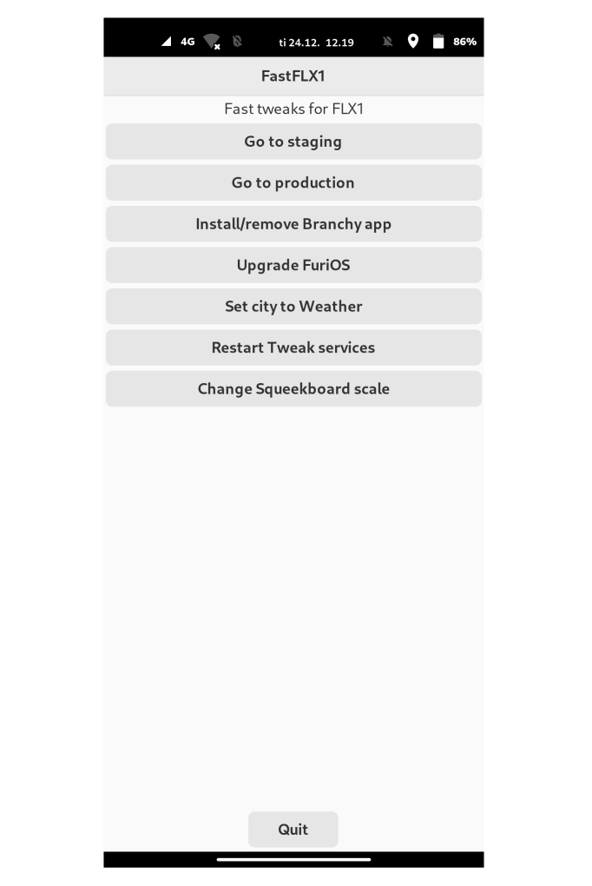

# FastFLX1 - some tweaks for best linux phone in the market

This simple tool adds some small tweaks to your FLX1. 
**Notice: If you have done some own tweaks to your ~. files it might be good idea to make backup because this setup will override some of them. This includes also changes what are done via GUI but actually happens in ~. files like changing ringtone from Phosh-mobile-settings**

Update or remove this via desktop actions - aka. long press from the desktop icon

Mainly: 
1. Alarm volume script which will ensure that your alarm clock will allways play with full sound - and GUI interface to restart this service script if it fails
2. Dialtone script which will make your phone vibrate and blink led in interval when you are calling out (most carriers does not generate dialtone sound in VoLTE so this kind of replaces it) - and GUI interface to restart this service script if it fails
3. Simple GUI interface for changing from staging to prod or via versa - or upgrade your system trough terminal - or install/uninstall experimental Branchy app
4. GUI interface for changing Squeekboard (the virtual keyboard) scaling 
5. Asisstant-button tweaks which are partially work-in-proggress but it shows proof-of-concept how to make assintant-button behave differentially based on certain conditions
6. Disable annoying volume change sound (blop - blop when change volume) - and add better alarm tone. This works now ootb.
7. If you use finnish layout in squeekboard you will get the ultimate universal layout made by me
8. Provide thumbnails (image preview) for all images which are located in home folder but not in hidden folders. Now you can see what file you are choosing when you use file picker - or when you browse your files trough Nautilus. This is build as service which will also monitor new images, name changes, moved images etc. And GUI interface to restart this service script if it fails
9. Added some cool swipe gestures using lisgd - look below
10. Automatic call volume adjustment which will adjust volume to 40% if you use earpiece and to 100% if you use speaker - you can still adjust volume also manually but this will make sure that you have at least okayish sound all the time
11. If you receive call from unknown number you can now easily create new contact. Last callers number is automaticly saved to clipboard if you are using dialtone script so just short-press assistant-button and select "Add last caller (or copied number) to contacts". It will automagicly opens new contact dialog and pastes the number there - you just need to fill name etc. You can also copy number manually because it will use the default paste function
12. Remapped VolumeUp to normal Up button and VolumeDown to normal Down button. Now the quick shortcuts (when pressing assistant-button) are navigated easily with volumebuttons - press assistant-button shortly to choose preferred action

**Default assistant-button options:**

- If wofi shortcut panel is open short press from assistant-button is Enter (select)
- Unlocked short-press = opens wofi-shortcut panel with options to copy, paste, cut, terminal paste, kill active app, add last caller (or copied number) to contacts and option to close shortcut panel
- Unlocked double-press = opens wofi-shortcut panel with options to set display scale to 300%, 275%, 250%, 200%, 150% and also you can set the scale-to-fit to ture or false (which will try scale all apps to fit to the screen - true is not recommended but fast fix for some desktop apps) and option to close shortcut panel
- Unlocked long-press = opens wofi-shortcut panel with options to go back (escape - for android mostly but works in some linux apps too), and then it lists most ram eating apps and option to kill them and option to close shortcut panel
- Locked / on lock screen short-press = toggle the feedback theme (full - silent - quiet)
- Locked / on lock screen double-press = toggle flashlight
- Locked / on lock screen long-press = it will forcefully close all resource intensive apps

**Default volume-buttons options:**

- They will change volume if you have active sink (like music playing or active call). Otherwise they are up and down arrow keys (like arrow keys in keyboard)

**Default swipe gestures:**
Notice that swipe gestures works ootb like this when FLX1 is in default portrait mode
- From the bottom swipe from left to right and it will change the open app which is on the right side of your current active window
- From the bottom swipe from right to left and it will change the open app which is on the left side of your current active window
- From the left edge long swipe from left to right will kill the active app

I am working on this slowly and will add more (GUI) features soonish (or remove some parts what Barry and Jesus from Furilabs make unnecessary ;) ). If you wan't to help feel free to send me message, open issue or so. 

## How to install?

`sudo apt install git && cd ~ && mkdir -p .git && cd .git && git clone https://gitlab.com/Alaraajavamma/fastflx1 && cd fastflx1 && sudo chmod +x install.sh && ./install.sh `

And it should just work

Remove?
Long press desktop icon and it will give you option to Uninstall. Or you can: 
`cd ~ && cd .git && cd fastflx1 && ./uninstall.sh`

## License
Feel free to do what ever you want with this but no guarantees - this will probably explode your phone xD

## Something else?
If you wan't to help or find issue feel free to contact

